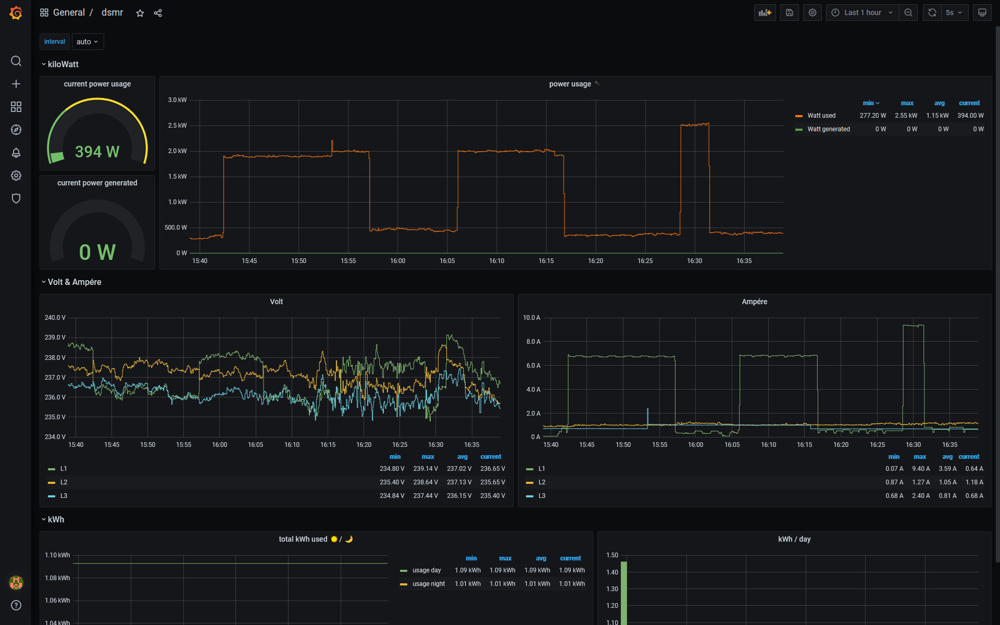

# dsmr exporter

dsmr exporter is a daemon that reads smart meter  p1 data (dsmr) and converts it to a elastic search document.

dsmr_exporter can read data from: 
- multiple serial port's
- multiple esp8266's

This software needs hardware to work.  To find out more about the supported hardware, check out `docs/hardware.md`

# installation

## from source

    sudo pip3 install pyserial
    sudo pip3 install elasticsearch
    git clone https://github.com/pvcbe/dsmr_exporter.git
    
## pip

TODO

     
# using

this example reads data from the *ttyUSB0* serial port and export the data to host *192.168.0.103*

     ./dsmr_exporter.py --serial /dev/ttyUSB0 --elastic-host 192.168.0.103

- attention: your user needs read access to the serial device

    export P1_SERIAL=/dev/ttyUSB0
    export P1_HOST=10.0.0.16:5678,172.16.0.2:8898
    export ELASTIC_HOST=192.168.0.103:1234
    ./dsmr_exporter.py

    
this example uses environment variables to read its config:
- serial input on `/dev/ttyUSB0`
- tcp host `10.0.0.16` on port `5678` and tcp host `172.16.0.2` on port `8898`
- elastic search host on ip `192.168.0.103` on port `1234`

## options

option                     |environment variable| default |
---------------------------|--------------------|----------
`--p1-serial`              | `P1_SERIAL`        | -
`--p1-host`                | `P1_HOST`          | -
`--elastic-host`           | `ELASTIC_HOST`     | localhost:9200
`--elastic-index`          | `ELASTIC_INDEX`    | dsmr-%Y.%m

# example dashboard

there are is an example dashboard for **elasticserach** and one for **grafana**.  They are located under `docs/dashboards`.
The grafana source name is **elasticsearch-dsmr**.  don't forget to create a datasource with that name (ore change the dashboard) 

# elasticsearch

It is wise to create a rollup job or delete old dsmr indexes.  Or to buy more storage as time passes :)

# reference

[dsmr standard document](https://www.netbeheernederland.nl/_upload/Files/Slimme_meter_15_a727fce1f1.pdf)

