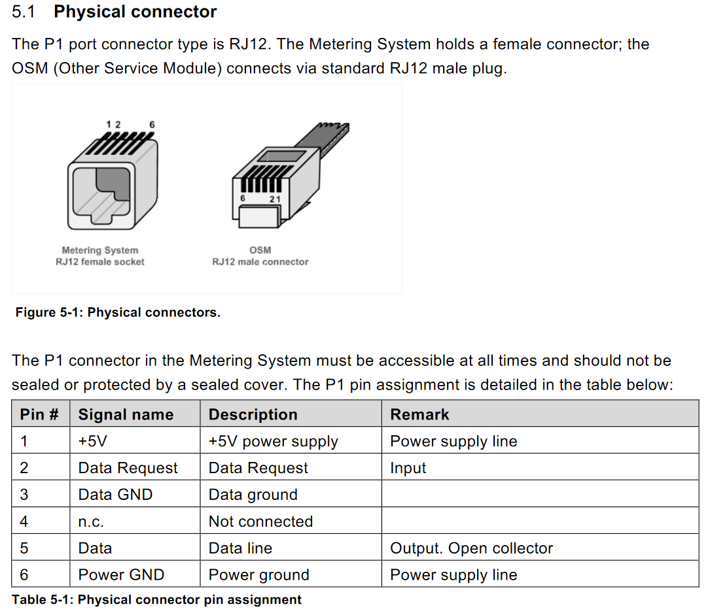
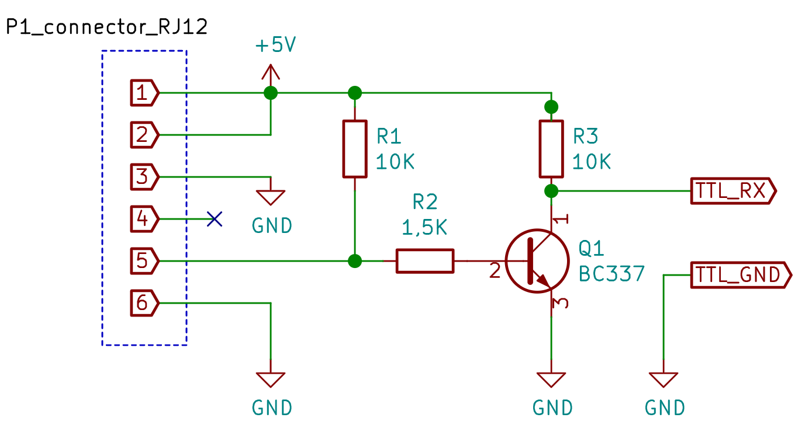
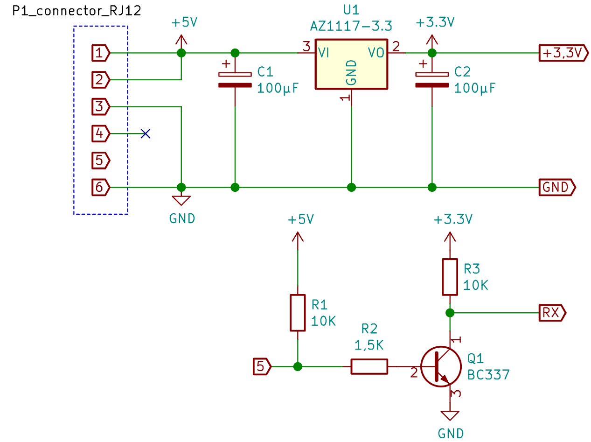

# hardware
## p1 port on a smart meter

Most smart meters have a S1 and a P1 port.  dsmr exporter needs the P1 port.  
In Belgium you need to activate the port, this can be done via https://mijn.fluvius.be/poortbeheer
This process differs per country, you should search the internet for you country.  

The P1 port delivers +5V (maximum load 250mA).  Here is a pinout of the port, from the datasheet:

## serial 
- Ready made cable's are available online.

  these cable's have an built-in ttl inverter for pin 5, an don't need any soldering:
    - [aliexpress](https://nl.aliexpress.com/item/32945187155.html) 
    - [search](https://duckduckgo.com/?q=dsmr+p1+cable)  

-  self made made cable

  for this you need a serial ttl port.  Serial ttl ports come in many different forms:
  
  - rasberry pi
  - microcontrollers
  - usb to serial cables (example: [kiwi](https://www.kiwi-electronics.nl/usb-to-ttl-serial-kabel), [gotron](https://www.gotron.be/ft232-usb-naar-ttl-adapter-3-3-5v.html))      

    next thing you need is a ttl inverter.
 
    The data signal of a p1 port is inverted and standaard ttl serial won't understand the p1 signal.
    a simple transistor inverter will do the job.      
    
     
    
    - connect the RX output label to the rx of the usb ttl.
    - connect ground RJ12 to the ground of the  inverter and the ground usb ttl.
    - connect pin 1 (+5V) to pin 2 (DATA REQUEST), there is no need to connect the +5V pin to your ttl cable.
    

  In linux you can test the output of the serial port with a simple command:

        screen /dev/ttyUSB0 115200

  On Windows you can use [putty](https://www.chiark.greenend.org.uk/~sgtatham/putty/latest.html) to show the output of the serial port.

  The output should look like this:

        0-0:96.1.4(50215)
        0-0:96.1.1(1111111111111111111111111111)
        0-0:1.0.0(111111111111S)
        1-0:1.8.1(001033.309*kWh)
        1-0:1.8.2(000957.520*kWh)
        1-0:2.8.1(000000.000*kWh)
        1-0:2.8.2(000000.232*kWh)
        0-0:96.14.0(0002)
        1-0:1.7.0(00.217*kW)
        1-0:2.7.0(00.000*kW)
        1-0:21.7.0(00.006*kW)
        1-0:41.7.0(00.182*kW)
        1-0:61.7.0(00.028*kW)
        1-0:22.7.0(00.000*kW)
        1-0:42.7.0(00.000*kW)
        1-0:62.7.0(00.000*kW)
        1-0:32.7.0(238.0*V)
        1-0:52.7.0(236.4*V)
        1-0:72.7.0(237.6*V)
        1-0:31.7.0(000.07*A)
        1-0:51.7.0(001.00*A)
        1-0:71.7.0(000.14*A)
        0-0:96.3.10(1)
        0-0:17.0.0(999.9*kW)
        1-0:31.4.0(999*A)
        0-0:96.13.0()
        !8AB2
        /FLU5\253769484_A

 
## esp

This requires some soldering.  I don't know any of the shelf hardware for this.
You need: 
- an [esp flasher](https://www.instructables.com/ESP-01-Programmer-Hack-the-Easy-One-/)
- [RJ12 connector](https://www.reichelt.de/modular-stecker-rj12-kontakte-6-bestueckt-6-mp-6-6-p12707.html?CCOUNTRY=445&LANGUAGE=de&trstct=pos_12&nbc=1&&r=1) (you need a tool to use these connectors: [example](https://www.reichelt.de/crimpzange-fuer-modular-rj11-rj12-rj45-gb-77146-p293078.html?&trstct=pos_4&nbc=1) )
- a [esp8266](https://en.wikipedia.org/wiki/ESP8266), example store: [gotron](https://www.gotron.be/catalogsearch/result/?q=ESP8266)
- 3,3V LDO, example [az1117-3.3V](https://uk.farnell.com/diodes-inc/az1117d-3-3tre1/ldo-fixed-3-3v-1a-40-to-125deg/dp/3483077?st=az1117%203.3)
- npn transistor [bc337](https://uk.farnell.com/search?st=bc337)
- 2x 10 to 100µ F capacitor's (6,3V or more)
- 2x 10K ohm resistor
- 1x 1500 ohm resistor
- some cable, I used old utp wires

The following diagram show's the rj12 and the power circuit.
diagram:

- connect the 3,3V to the Vcc of the esp
- connect the GND to the GND of the esp
- connect the RX of the transistor to the RX of the esp
- **connect the +3,3V to the CH_PD (this is the ENABLE pin)**
 
Different firmware is available to create an serial to tcp server with an esp8266.  Wich one to choose is up you.
Flashing and programming an esp is beyond the scope of this document.  Here are some pointers:
- [jeelabs](https://github.com/jeelabs/esp-link#serial-bridge)
- [easy-esp](https://espeasy.readthedocs.io/en/latest/Reference/Flashing.html) and create a "serial server" 

good luck

